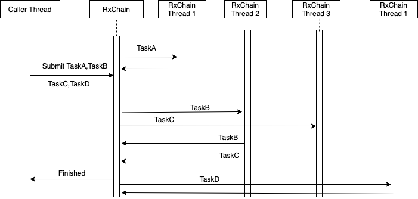

# Chain-z 

[](https://github.com/intuit/chain-z/actions/workflows/maven-build.yml)
[](https://maven-badges.herokuapp.com/maven-central/com.intuit.apl/apl-core)


**_Mastering Asynchronous Execution and paving the Way for Efficient async task orchestration._**
It provides Async Execution of code in Java based application.
This framework in written using Rx Java.Can be extended to write in any other choice of async implementation. 

## Benefits
1. It allows developers to run code in an asynchronous manner without any hassle. 

2. It provides neat and an efficient way of orchestrating asynchronous tasks.

3. Developers don't have to write boilerplate code as it takes care of this for you, so you can focus on writing your business logic without worrying about async execution which helps you save time and effort.

4. It is built on top of Rx Java, which means it can be extended to use any other async implementation. This makes it highly adaptable and flexible for your needs. 

5. No need for @async annotation or Futures/CompletableFuture implementation. 

6. It is user-friendly and easy to integrate with your existing projects, you can get started quickly and efficiently without any technical difficulties.

## Use case
In any java application or any backend application there is a need of executing any business logic in async so that main thread can be freed or series of business logic needs to be performed one after the another or all of them can be executed independently parallely.
 So in any of the cases everyone has to write the boilerplate code to handle this use case.
 
##### User can use any of the below approaches to achive this.
 
 ```
 1. @async annotaton of Spring 
 2. using Futures of Java
 3. Completeable future of java
 4. using  rxjava.
 
 ```

If this is to be done at many places same code has to be repeated.This Framework will solve this and developer can directly focus on writing the business logic without worrying about the boilerplate code to handle async execution.

```
Lets take an example:

Suppose We need to place an order for an item that involves checking the inventory,Prepare Shipping Order,Scheduling Delivery,Send order confirmation 

Lets name this actions as Task A,Task B,Task C,Task D
```

### In naive way how user will implement is
```
1. First make a call to execute TaskA
2. Then make call to TaskB
3. make call to Task C
4. make call to Task D
```


after Task A executes then only TaskB and Task C can execute but can execute in parallel then post completion of this TaskD can execute.

Here TaskA --> then TaskB,TaskC ---> TaskD

#### If we need to implement such scenario it will be very simple using this library.

```java
public class TaskA implements Task {
	public State execute(State inputRequest) {
		// checking the inventory
		inputRequest.addValue("TaskAResponse","response");
	}
}

public class TaskB implements Task {
	public State execute(State inputRequest) {
		// Prepare Shipping Order
		inputRequest.addValue("TaskBResponse","response");
	}
}

public class TaskC implements Task {
	public State execute(State inputRequest) {
		// Scheduling Delivery
		inputRequest.addValue("TaskCResponse","response");
	}
}

public class TaskD implements Task {
	public State execute(State inputRequest) {
		// Send order confirmation 
		inputRequest.addValue("TaskDResponse","response");
	}
}
```

```
We need to create a State request that is shared between each Task.

1. we need to  create a request
State request = new State();

req.addValue("TaskARequest", 1);
req.addValue("TaskBRequest", 1);
req.addValue("TaskCRequest", 1);
req.addValue("TaskDRequest", 1);

2. Create the Tasks that we want to execute

 TaskA taskA = new TaskA();
 TaskB taskB = new TaskB();
 TaskC taskC = new TaskC();
 TaskD taskD = new TaskD();

3. execute the tasks

State response = new RxExecutionChain(request, taskA).next(taskB, taskC).next(taskD).execute();

4. fetch the response of any task from the response by calling response.getValue("TaskDResponse");

```

```
in this taskA will first execute in a separate thread then as soon as it completes taskB and taskC will execute parallelly and post its  completion taskD will execute.Main thread will wait for all action to execute.

If we don't want main thread to wait if we want to do fire and forget just call executeAsync() instead on execute.
```

```
Task can be marked as fatal and non fatal as well so in case of fatal chain will break and in case of non fatal tasks chain will continue even if exception is thrown from the tasks.
```

### Sequence flow



### Rollback (v1.0.4)
```
The task has a method onError, which can be used to define rollback steps for the task.

These on error method gets called in the reverse order of the task chain.

For Example:
Chain: Task A -> Task B -> Task C -> Task D.
And an error occurs in Task C.

The error method would be called in the order
Rollack Task C -> Rollack Task B -> Rollack Task A

The state would provide for the error, exception, which can be utilised within the onError method.

Use the `executeWithRollback` method of RxExecutionChain.

```

### Features:
```
* Support for Custom executor instead of unbounded cached thread pool based on config flag.
* Logging of time taken by each task based on a config flag.
* Execute chain of Tasks in Sync and Async
* Executing rollabck steps for each task, in reverse fashion. 
```
### Usage
#### Execution chain Client

Execution chain can also be created using below ExecutionChainClient that supports configuration like log time,custom thread pool executor

```java
  ExecutionChainClient executionChainClient =
        ExecutionChainClient.create()
            .logTime(true)
            .executor(Executors.newFixedThreadPool(2))
            .build();
            
  executionChainClient.getExecutionChain(request, taskA,taskB).next(taskC).execute();
```
```
It will log time like:
19:32:39.648 [RxCachedThreadScheduler-3] DEBUG com.intuit.async.execution.impl.RxExecutionChain - message=Time taken,taskName=DummyTaskWithExceptionTest,ttl=3ms
```

#### Copy MDC values from Parent to child threads

If you want to Auto copy MDC values from parent to child thread you can call below snippet once for your application.
If threads are getting reused it will clear the current mdc of thread before copying.

``` java
  RxJavaPlugins.setScheduleHandler(new MdcPropagatingFunction());
```

### Local Development
- Clone the code
- Build by running `mvn clean install`

### Contributing
Refer [contribution guidline](CONTRIBUTING.md)

